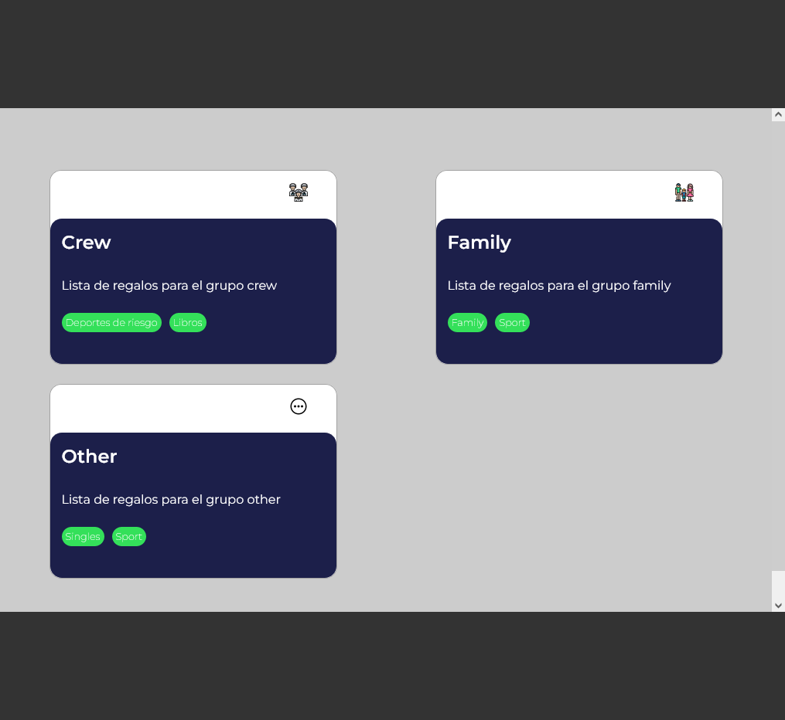

# Lista de Regalos para Hack Job Barcelona

This project was generated with [Angular CLI](https://github.com/angular/angular-cli) version 13.0.1.

## Development server

Run `ng serve` for a dev server. Navigate to `http://localhost:4200/`. The app will automatically reload if you change any of the source files.

## Code scaffolding

Run `ng generate component component-name` to generate a new component. You can also use `ng generate directive|pipe|service|class|guard|interface|enum|module`.

## Build

Run `ng build` to build the project. The build artifacts will be stored in the `dist/` directory.

## Running unit tests

Run `ng test` to execute the unit tests via [Karma](https://karma-runner.github.io).

## Running end-to-end tests

Run `ng e2e` to execute the end-to-end tests via a platform of your choice. To use this command, you need to first add a package that implements end-to-end testing capabilities.

## Further help

To get more help on the Angular CLI use `ng help` or go check out the [Angular CLI Overview and Command Reference](https://angular.io/cli) page.

## Solución para  el componente lista de regalos 

Esta es una solución para el componente usando Angular.

## Vista General

### El reto

Task 1 -> Crear un componente con un título, una descripción y un grupo de regalos que contenga la siguiente información: Título, Descripción, Tags del grupo

Task 2 -> Asegurarse que el componente sea responsive: Adopta un modo de scroll horizontal para PC, Adopta modo lista para Móvil y Tablet

#### Subtareas

Al clicar en cada grupo de regalos permite ejecutar una acción (por ahora indefinida).

Utilizar un sistema lo más atómico posible

Comentar el desarrollo de este componente

### Capturas de pantalla

### Enlaces

- Solution URL: [GitHub](https://github.com/ManuelFernandezEsteban/)
- Live Site URL: [GitHubPages](https://manuelfernandezesteban.github.io/)

## El Proceso

### Built with

- Angular
- CSS custom properties
- Flexbox
- CSS Grid
- Mobile-first workflow

## Author

- linkedIn - [LinkedIn](www.linkedin.com/in/manuel-fernandez-esteban)